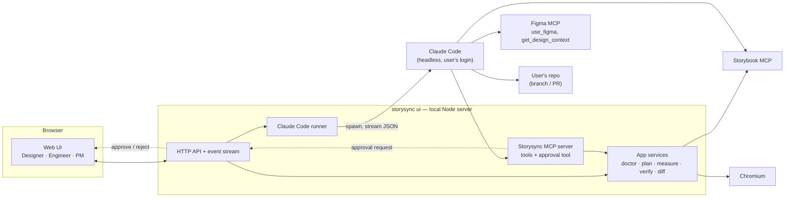

# 0006. Build the UI as a local web app that drives headless Claude Code

**Status:** Accepted, with the amendments below. Evidence: spikes [S5](../../research/2026-10-07-s5-headless-claude-code.md), [S5b](../../research/2026-10-07-s5b-two-way-session.md), [S8](../../research/2026-10-07-s8-component-generation.md), [S8b](../../research/2026-10-07-s8b-guided-generation.md).
**Deciders:** Biswarup Mondal
**Date:** 2026-10-07
**Solves:** A8; implements product decisions [0003](../../product/decisions/0003-ui-orchestrating-mcp-not-figma-plugin.md), [0005](../../product/decisions/0005-run-ui-locally-first.md), [0009](../../product/decisions/0009-claude-code-only.md)

## Context

The product decisions require a UI for designers, engineers and PMs that:
- orchestrates Figma MCP, Storybook MCP and Storysync (no Figma plugin)
- runs **locally on each person's machine** first
- uses **Claude Code as the only AI runtime**
- will later turn Figma designs into component code in the user's repo ([0006](../../product/decisions/0006-figma-to-storybook-full-scope.md))

Other forces:
- **Most of the work doesn't need an AI.** `tokens`, `map`, `snap`, `verify`, `diff` and `doctor` are deterministic.
- **Figma's write tool (`use_figma`) only works in supported MCP clients.** Claude Code is one.
- **UX principle 2, "show before you change":** writes to Figma or code need a preview and an approval.

## Decision

1. **`npx storysync ui`** starts a local Node server and opens the UI in the browser.
2. **Deterministic path, no AI:** the UI calls the app services ([target architecture §5](../target-architecture.md#5-application-services-returning-view-models)) directly for setup, `doctor`, previews, measuring, scores and drift views.
3. **Agent path, Claude Code:** for writing to Figma, and later to code, the server **spawns the user's Claude Code in headless mode** (`claude -p` with streamed JSON output). It passes:
   - an MCP config adding **Storybook MCP** and **Storysync's own MCP server**, which exposes the app services as typed tools
   - the task prompt, generated from the single-sourced procedure (plan 4.1)
   - Figma MCP comes from the user's own Claude Code setup (the Figma connector or plugin)
4. **Approvals:** Claude Code's permission prompts are routed to a tool on Storysync's MCP server (Claude Code's permission-prompt-tool option). The tool asks the UI and waits. Nothing that writes to Figma or the repo runs until the user approves it on screen.
5. **Progress** streams from Claude Code's JSON output to the UI as server-sent events: step, component, readback, fidelity score.
6. **Code changes** (Phase 6) happen on a new branch in the user's repo and end as a pull request.

## Options considered

| Option | For | Against |
|---|---|---|
| **Local server driving headless Claude Code** | Claude Code is a supported Figma MCP client; reuses the user's login and connectors; approvals and progress in our UI | Every user needs Claude Code installed and logged in; depends on its headless interface |
| Claude Agent SDK in our server | Full control of the agent loop | Ruled out by [0009](../../product/decisions/0009-claude-code-only.md); Figma MCP auth unproven; needs API keys |
| UI only shows instructions; user runs Claude Code themselves | Simplest | Laypeople would need the terminal, which fails the success measure ([0007](../../product/decisions/0007-success-measure-layman-pushes-component.md)) |
| Hosted web app | One link for everyone | Deferred by [0005](../../product/decisions/0005-run-ui-locally-first.md) |

## Consequences

- The app-services refactor (plan item 2.6) is a prerequisite.
- The agent's procedure moves from three skill files into one source that generates both the skills and the UI's prompts (plan 4.1).
- Onboarding must check for Claude Code, its login and the Figma connector, and guide the user through any that are missing (`doctor`).
- Tied to Claude Code's headless interface and flags, so contract tests are needed when Claude Code updates.

## Amendments from spike S5

The [S5 research note](../../research/2026-10-07-s5-headless-claude-code.md) confirmed all five checks on Windows, and changes the design in these ways:

1. **Role as system context.** Storysync's role and the user's authority go in `--append-system-prompt`. The stdin message carries only the user's request. Without this, Claude treated the task as a possible prompt injection (F2).
2. **Two-way session, one process per task.** Run Claude Code with `--input-format stream-json` and keep one process per UI task. Answer `AskUserQuestion` through the approval tool's `updatedInput.answers` (shown as buttons). Answer free-text questions with the next message (shown as a reply box). Confirmed by [spike S5b](../../research/2026-10-07-s5b-two-way-session.md) (F3).
3. **Restrict tools per task.** Approvals don't see calls Claude Code auto-allows as read-only. Each task gets an explicit tool list (`--disallowedTools Bash,Write,Edit` for Figma pushes), and code-writing tasks run on a separate branch or worktree (F4).
4. **Specific rejection reasons.** The UI's rejection message is passed to Claude word for word, so it must say what was rejected (F7).
5. **Detect the Figma server.** Users may have the claude.ai Figma connector, the Figma plugin, or both, with different tool names. `doctor` detects which is available, and prompts don't hard-code a server name (F1).
6. **Always set the model.** The default can be Opus with a 1M context, which is much more expensive. The runner always passes `--model` (F5).
7. **Own the session's processes.** The runner records the PID of every process the session starts and stops exactly those when the task ends. Matching command lines is not enough: in [S8b](../../research/2026-10-07-s8b-guided-generation.md) it missed one process and hit an unrelated one (B7). Claude may only stop processes the session started. In [S8](../../research/2026-10-07-s8-component-generation.md), a Storybook started by Claude outlived the session (R6).
8. **Policy by place, not by command.** Allow `localhost` and Claude Code's own temp folder. Check the working directory of Bash commands, not only Write/Edit paths (R6).
9. **Typed completion.** Tasks end with a `storysync_submit_result` tool call on Storysync's MCP server, not by parsing the final reply (R7).

## Spike S5 (passed)

From a small local Node script, check that:

1. Headless Claude Code can be spawned and its streamed JSON parsed into progress events.
2. **The user's Figma MCP is available in headless mode** and `use_figma` can write to a test file.
3. Storybook MCP and a custom MCP server can be added for the run.
4. Permission prompts can be routed to our own MCP tool, so approval can come from the UI.
5. It works on Windows and macOS.

Write the results to `docs/research/`. If check 2 fails, the fallback is to run the Figma part in the user's interactive Claude Code session with the generated prompt, with the UI showing progress from Storysync's files.

## Still open

- **S7:** whether the Figma REST API is enough for PM views without an agent (lower priority until hosting).
- **Front-end stack.** Building with 4flow's own Vue component library would be a good test of Storysync on itself.
