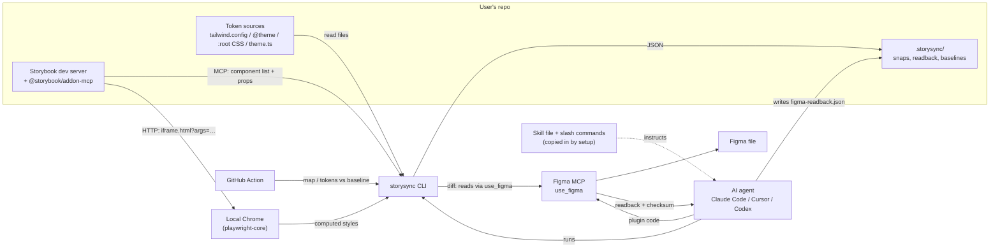
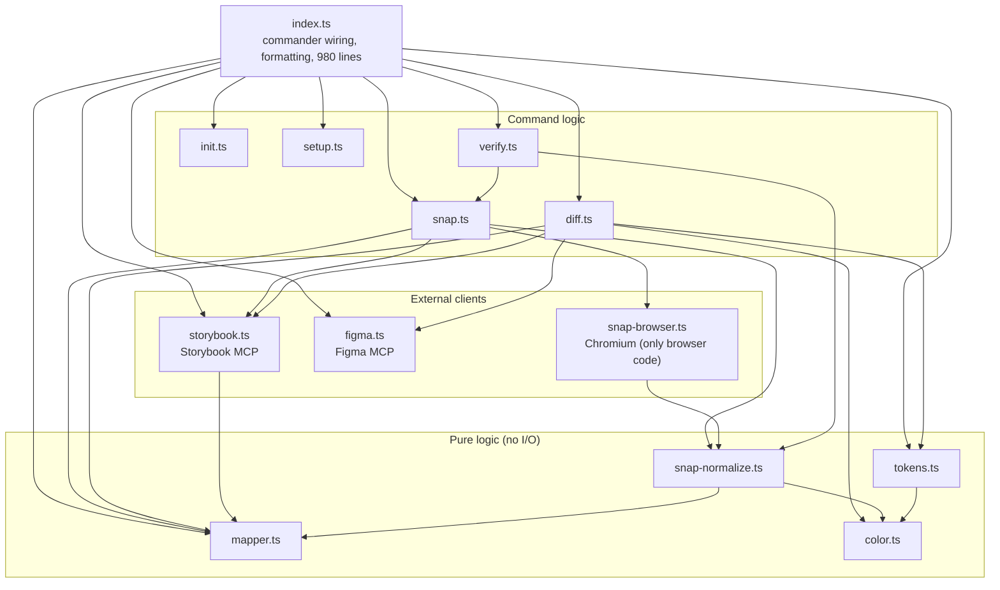
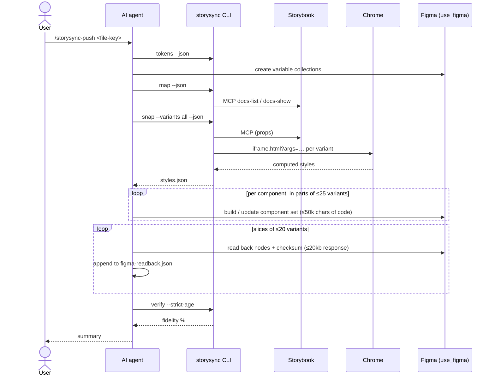

# Architecture: current state

**Status:** Accepted (describes `main` at `9f8299a`, v0.3.0)
**Last reviewed:** 2026-10-07

This describes how Storysync is built today. For where we want to take it, see [target-architecture.md](target-architecture.md).

## In one paragraph

Storysync is a Node CLI (TypeScript, ESM, about 9,000 lines in `cli/`) that extracts **deterministic JSON** from a codebase and a running Storybook: tokens, component variant maps and measured styles. It **never writes to Figma itself**. Writing is done by an AI agent (Claude Code, Cursor or Codex), following a long skill file that Storysync copies into the user's project. After the agent writes, the CLI scores what landed in Figma against what was measured.

## System context

## Integration boundaries

Storysync touches four external systems. How it reaches each one decides most of the user's setup work.

| Boundary | How Storysync reaches it | Code | What it costs the user |
|---|---|---|---|
| **Project source** | Reads files from disk with regexes and heuristics | [tokens.ts](../../cli/tokens.ts), [color.ts](../../cli/color.ts) | Nothing, as long as detection guesses right |
| **Storybook: catalogue and props** | MCP client (streamable HTTP, falling back to SSE) calling the addon's docs tools: `docs-list` and `docs-show`, called `list-all-documentation` and `get-documentation` before 10.6 | [storybook.ts](../../cli/storybook.ts) | Install `@storybook/addon-mcp`, register it, enable framework flags, and run the **dev server** |
| **Storybook: rendering** | Plain HTTP: opens `iframe.html?id=…&args=…` in a local Chromium and reads `getComputedStyle` | [snap.ts](../../cli/snap.ts), [snap-browser.ts](../../cli/snap-browser.ts) | A Chromium-based browser installed |
| **Figma: writing** | None. The AI agent runs Figma Plugin API code through `use_figma` | [skills/](../../skills/), [commands/](../../commands/) | An MCP-capable AI client, a Full seat, the Figma connector |
| **Figma: reading (diff)** | MCP client calling `use_figma` with read-only plugin code | [figma.ts](../../cli/figma.ts), [diff.ts](../../cli/diff.ts) | Same as writing |

**Key finding:** MCP is used only for `listComponents()` and `getComponent()` ([storybook.ts:249-254](../../cli/storybook.ts#L249-L254)). Rendering never touches MCP. Every repo change we ask users to make exists to get the component list and prop types.

## Modules

| Module | Responsibility | Notes |
|---|---|---|
| `index.ts` | Defines the commands (`map`, `snap`, `verify`, `list`, `tokens`, `inspect`, `diff`, `init`, `setup`), parses options and formats text output | Command wiring and presentation mixed in one file |
| `tokens.ts` | Detects the token source, parses Tailwind configs, `@theme`, `:root` and theme files, resolves `var()` chains, categorizes by name prefix, compares baselines | Fixed detection order ([tokens.ts:87-101](../../cli/tokens.ts#L87-L101)) |
| `mapper.ts` | Storybook prop types → Figma variant properties, counts combinations, applies caps | Skips `string`, `number`, functions and slots |
| `storybook.ts` | MCP client; parses the docs tools' **markdown** output into components and props | Depends on the wording of addon-mcp's output |
| `snap.ts` | Chooses which variants to render, orchestrates capture, writes `styles.json` and `meta.json` | |
| `snap-browser.ts` | The only module that drives a browser | |
| `snap-normalize.ts` | Raw computed styles → normalized shape; builds story URLs; slugs | Pure and well tested |
| `verify.ts` | Compares the Figma readback with snap's measurements, checks checksums, gives a fidelity score | Detects tampered or echoed readbacks |
| `figma.ts` | Figma MCP client for reads; handles the 20kb response limit and rate limits | |
| `diff.ts` | Compares tokens and components between code and Figma | |
| `init.ts` | Detects the Storybook version, installs addon-mcp, edits `main.ts` with a **regex** | Regex at [init.ts:251](../../cli/init.ts#L251) |
| `setup.ts` | Copies the skill and commands for a given AI client | |

## Data contracts

Everything between steps is a file. This is the strongest part of the design: each step can be checked, diffed and replayed on its own.

| Artifact | Produced by | Consumed by |
|---|---|---|
| `tokens --json` | `tokens` | Agent (to create variables), `diff`, CI baseline |
| `map --json` | `map` | Agent, CI baseline |
| `.storysync/snaps/styles.json` + `meta.json` | `snap` | Agent (to build components), `verify` |
| `.storysync/figma-readback.json` | Agent, copying `use_figma` output whole | `verify` |
| `.storysync/baseline.json`, `tokens-baseline.json` | `map --json`, `tokens --json`, committed | GitHub Action |

## The push flow

## Strengths to keep

1. **Measured, not guessed.** Styles come from the rendered DOM, not from interpreting Tailwind or `cva` in source.
2. **Deterministic CLI, JSON contracts.** Every intermediate result can be diffed, baselined and replayed.
3. **Verifiable writes.** The checksummed readback plus `verify` make it possible to show the agent didn't make values up.
4. **Pure and I/O code kept apart** (`snap-normalize.ts` vs `snap-browser.ts`), which makes most of the logic testable without a browser.
5. **Careful handling of Figma's real limits** (code size, response size, auto layout, stroke alignment).

## Architectural problems

Each problem links to evidence from the [Vue field test](../research/2026-10-07-vue-library-field-test.md).

| # | Problem | Effect on users | Evidence |
|---|---|---|---|
| A1 | **Storybook access is coupled to addon-mcp's docs tools.** It's the only way to get the catalogue and props. | Users must change their repo and run the dev server. Published or authenticated Storybooks can't be used. | Field test steps 1-2, 6-9 |
| A2 | **Framework requirements are implicit.** There's no model of what each framework needs (Vue needs `componentsManifest` and `experimentalDocgenServer`). | Vue looks unsupported. Error messages blame the Storybook version. | Steps 8-9; [README.md:590](../../README.md#L590) |
| A3 | **Config files are edited with a regex.** | Fails on quoted keys, the format Storybook's own installer writes. | Step 6; [init.ts:251](../../cli/init.ts#L251) |
| A4 | **Version is resolved before install.** `init` reads the version from `node_modules`, then installs, which can change it. | Mismatched addon and Storybook versions | Step 7 |
| A5 | **No project configuration.** Storybook URL, token source and component scope are flags on every run, and detection uses one fixed order. | Repetitive commands; wrong guesses can't be corrected once and remembered | Steps 3-5 |
| A6 | **Token categories come only from name prefixes.** | Design systems that don't follow those prefixes lose most of their tokens | Step 4 |
| A7 | **The write path is a program written in prose.** The Claude Code skill is about 10,000 words, and push step 6 alone is about 1,000. It exists in three near-copies (`claude-code.md`, `codex.md`, `cursor.mdc`, about 27,000 words in total). | Expensive in tokens, slow, non-deterministic, and hard to change without the copies drifting apart. Correctness is only checked after the fact, by `verify`. | [skills/](../../skills/), [commands/storysync-push.md](../../commands/storysync-push.md) |
| A8 | **No presentation layer.** Results are terminal text, formatted inside `index.ts`, or raw JSON. | No way to show users what will happen before it happens, and nothing for a UI to build on | [index.ts](../../cli/index.ts) |
| A9 | **Skipped props are silent.** `mapper.ts` drops `string` props without telling the user. | Components appear with fewer variants than expected, or none (Badge) | Step 11 |
| A10 | **Prop data depends on parsing markdown.** `storybook.ts` parses the docs tools' markdown. | Can break whenever addon-mcp changes its wording; it already changed tool names at 10.6. | [storybook.ts:121-135](../../cli/storybook.ts#L121-L135) |
| A11 | **Named union types hide their values.** A prop typed with a named union (`severity: ButtonSeverity`, where `ButtonSeverity = 'primary' | 'danger' | …`) reaches Storysync as just the type's name: Vue's docs don't spell out the members, and the mapper can only expand literal unions. | Most of a design system's real variants go missing. In the Vue library, Badge has no variants and Button loses `severity` and `variant`. Users see fewer Figma variants than their components have. | [Phase 1 field test, N1](../research/2026-10-07-vue-library-phase1-field-test.md); [mapper.ts:146](../../cli/mapper.ts#L146) |

## Constraints we don't control

- `use_figma` accepts at most 50,000 characters of code per call and returns at most 20kb.
- Figma's plugin context only offers Google Fonts.
- The Figma REST API can't create components, so writing components needs the Plugin API, through either `use_figma` or a Figma plugin. The REST API can write **variables**, but only on Enterprise plans.
- Storybook's component manifest and docs tools are new (10.1+) and still marked experimental for some frameworks.
