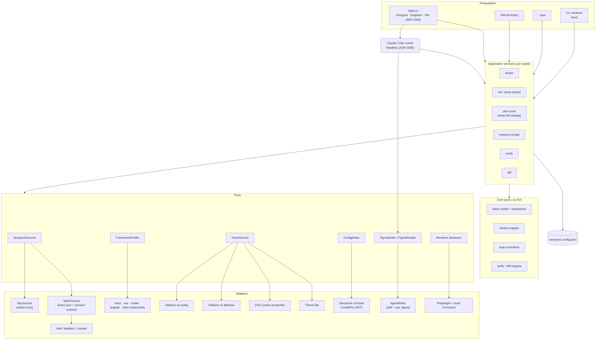
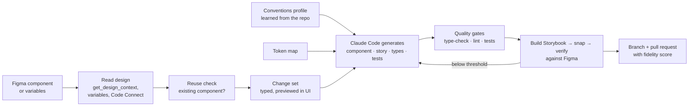

# Architecture: target state

**Status:** Proposed
**Last reviewed:** 2026-10-07
**Shaped by:** product decisions [0001-0009](../product/decisions/README.md); v1 scope (0008) still proposed

This is where we want the architecture to go, and why. It answers the problems listed in [current-state.md](current-state.md#architectural-problems). We'll get there step by step, without a rewrite. The order is in [plans/implementation-plan.md](../plans/implementation-plan.md).

## Goals

1. **No manual changes to the user's Storybook repo.** Whatever is needed is applied by the wizard, after asking (A1, A3). Reading published Storybooks with no changes at all comes with hosting.
2. **Any Storybook framework works**, or fails with a precise reason (A2).
3. **Set up once, then remember.** One config file, and a `doctor` command that proves the whole chain works (A3-A5).
4. **The same results can drive a CLI, JSON, CI or a UI.** No logic lives in the presentation layer (A8).
5. **Writing to Figma is as deterministic as reading.** Shrink what the AI agent has to get right (A7).
6. **Both directions, with the same proof.** Figma → Storybook produces reviewable code, measured and scored against Figma just like Storybook → Figma.

What we keep: measuring rather than guessing, JSON contracts between steps, checksummed readback and `verify`, and keeping pure code apart from I/O code.

## Shape

The architecture is ports and adapters ("hexagonal"). The core stays pure. Every outside system sits behind an interface, with more than one implementation where users need choice.



## Components

### 1. Project config: `storysync.config.json`
One file, written by the wizard and read by every command. Flags still override it. Covers A5.

```jsonc
{
  "$schema": "https://unpkg.com/storysync/schema.json",
  "storybook": {
    "url": "http://localhost:6006",          // or a published URL
    "source": "auto",                         // auto | mcp | static
    "auth": { "headersFromEnv": "STORYSYNC_SB_HEADERS" }
  },
  "framework": "auto",                        // or vue3-vite, react-vite, …
  "tokens": {
    "sources": ["src/styles/tokens.css"],     // explicit, ordered
    "categorize": {                           // user-defined name → category rules
      "radius": ["--aura-primitive-border-radius-*"],
      "typography": ["--p-*-font-size"]
    }
  },
  "components": { "include": ["Button", "Tag"], "maxCombinations": 256 },
  "figma": { "fileKey": "nge2jqPcZmYdtR6jbGmOis" }
}
```
Decided in [ADR 0004](adr/0004-project-config-file.md).

### 2. `StorybookSource` port
```ts
interface StorybookSource {
  listComponents(): Promise<ComponentEntry[]>;
  getComponent(id: string): Promise<StorybookComponent>; // props incl. enum options
  storyUrl(storyId: string, args: Record<string, unknown>): string;
  capabilities(): { props: boolean; docgen: "full" | "argTypes-only" | "none" };
}
```
- **McpSource**: today's `storybook.ts`, unchanged in behaviour.
- **StaticSource**: reads `index.json` for the catalogue, then opens `iframe.html` and reads prop types (`argTypes`) from the preview runtime in the browser, which Storysync already launches for `snap`. Works with published builds and needs **no addon**. With an auth adapter (headers or cookies from the environment), it also works behind SSO.
- `auto` tries MCP first, then static.

This covers A1 and A10, and is decided in [ADR 0002](adr/0002-storybook-source-adapters.md).
**Hypothesis to test in a spike:** the preview runtime exposes `argTypes` with enum `options` on static builds, for React and Vue.

### 3. `FrameworkProfile`
Data, not code paths. One profile per framework records:
- the Storybook feature flags and minimum versions needed for each source
- which docgen engine it uses, and how good its prop types are
- known gaps, with the message to show users

`doctor` and the wizard read profiles to check a setup and fix it. Errors name the missing flag instead of blaming the version. Covers A2; decided in [ADR 0003](adr/0003-framework-profiles.md).

### 4. `ConfigEditor`
Edits `.storybook/main.*` through Storybook's own config AST tooling (`storybook/internal/csf-tools`, the code that `storybook add` uses) instead of a regex. That handles quoted keys, `defineMain()`, and CommonJS. If the AST can't be edited safely, it shows the exact snippet to paste. Covers A3.
**To verify:** that the API is reachable and stable across Storybook 10.x. If it isn't, use `magicast` instead.

### 5. Application services, returning view models
Each use case (`doctor`, `plan push`, `measure`, `verify`, `diff`) returns a typed **result object**, never formatted text. Renderers turn results into terminal output, JSON or UI. `index.ts` shrinks to wiring. Covers A8, and is what makes a UI possible without duplicating logic.

`plan push` is new. It answers "what will this do to my Figma file?" before anything is written: components and variant counts, skipped props with the reason, token categories and uncategorized tokens. Covers A9.

### 6. `FigmaWriter`
- **AgentWriter**: today's skill-driven path. The skill keeps the *procedure*, and the Figma Plugin API code moves out of prose into **versioned code templates that ship with Storysync**. Skills for the three clients are **generated from one source** at build time. Covers A7: less text for the agent to read, and no drift between copies.
- AgentWriter runs in two hosts: the UI's orchestrator (section 8), and Claude Code, Cursor or Codex for engineers who prefer them.

A Figma plugin writer was rejected in product decision [0003](../product/decisions/0003-ui-orchestrating-mcp-not-figma-plugin.md). See [ADR 0005](adr/0005-figma-writer.md).

### 7. Token pipeline
`TokenSource` adapters each produce raw declarations. The **categorizer** in the core then applies built-in prefix rules **plus** the user's rules from config. Detection ranks all candidate sources and reports why it picked one ("tailwind.config.ts has no theme; using src/styles/tokens.css"), instead of returning the first match. Covers A5 and A6.

### 8. UI and Claude Code runner
A local web app (`npx storysync ui`) with role-based views for designers, engineers and PMs. Its server calls the app services directly for everything deterministic. For writes it spawns the user's **Claude Code in headless mode**, with Storybook MCP, the user's Figma MCP and Storysync's own MCP server (the app services as tools, plus an approval tool) available. Every write passes an approval gate in the UI. Details, risks and spike S5 are in [ADR 0006](adr/0006-ui-orchestration-architecture.md).

### 9. Figma → Storybook
Product decisions [0004](../product/decisions/0004-add-figma-to-storybook-after-usability.md) and [0006](../product/decisions/0006-figma-to-storybook-full-scope.md): after usability, a designer makes a component in Figma and pushes it to Storybook as proper, reusable code. All levels: tokens, new components, and changes to existing ones.



Building blocks:

| Block | Role | Exists today? |
|---|---|---|
| **Design reader** | Reads the Figma component, its variants, variables and Code Connect mappings through Figma MCP. Captures sizing mode (fixed, hug, fill) and line height, resolving Figma's "auto" line height to a number. Handles both library-based designs (instances → code components, variables → tokens) and from-scratch designs (raw values → nearest tokens or new tokens to approve; look-alike structures → existing components), per [0010](../product/decisions/0010-support-scratch-and-library-based-components.md) | Partly (`diff` reads components and variables) |
| **Conventions** | The repo's own AI guidance (`CLAUDE.md`, `AGENTS.md`, skills), which [S8](../research/2026-10-07-s8-component-generation.md) showed Claude follows well; Storysync detects gaps and doc/practice conflicts, and an engineer settles them once | Partly (lives in the user's repo) |
| **Reuse check** | **Done by Storysync, not left to the model:** search every component's docs, props and story names (and Code Connect) for the design's concepts and structure, then hand the candidates to Claude and the designer: use it, extend it, or make a new one. In [S8](../research/2026-10-07-s8-component-generation.md) and [S8b](../research/2026-10-07-s8b-guided-generation.md), Claude duplicated an existing component, even when told to search. | No (new) |
| **Change set** | Typed list of what will change: token X old → new; component Y new, with variants; prop added. Shown in the UI for approval. | No (new, built on `diff`) |
| **`CodeWriter`** | Claude Code, given the change set, the conventions profile and the token map, writes code on a new branch | No (new) |
| **Quality gates** | The repo's own type-check, lint and tests | Uses the user's scripts |
| **Reverse verify** | Build Storybook, `snap` the new component, `verify` against what Figma's design says. Loop back to Claude Code if fidelity is below the threshold, up to a limit. | `snap` and `verify` exist; the Figma side of the comparison is new |
| **PR** | Branch, commit and pull request, with the fidelity score and screenshots in the description | No (new) |

These map to the "proper component" checklist in [0007](../product/decisions/0007-success-measure-layman-pushes-component.md). The design is detailed in an ADR at plan item 6.1.

## Folder layout (target)

```
cli/                          → src/ (rename optional)
  core/        tokens/ mapper/ normalize/ verify/ diff/ color/
  ports/       storybook-source.ts figma-writer.ts token-source.ts config-editor.ts
  adapters/    storybook-mcp/ storybook-static/ auth/ frameworks/ tokens-*/ chrome/
  app/         doctor.ts wizard.ts plan.ts measure.ts verify.ts diff.ts
  render/      text/ json/
  config/      schema.ts load.ts
  index.ts     (commander wiring only)
skills/src/    one source → generated claude-code.md, codex.md, cursor.mdc
ui/           web front end + local server (ADR 0006)
cli/conventions/  learned code conventions (Phase 6)
```

## Migration path

This is done as a "strangler": each step ships on its own and keeps the tests green.

1. Add the `StorybookSource` interface around today's `StorybookClient` (no change in behaviour).
2. Add config loading, with flags still winning.
3. Move each command's logic out of `index.ts` into app services that return results, one command at a time.
4. Add new adapters (static source, framework profiles, AST config editor) behind the interfaces.
5. Generate the skills from a single source, and move the Figma Plugin API code into templates.
6. Build the UI server on the app services; add the orchestrator for writes ([ADR 0006](adr/0006-ui-orchestration-architecture.md)).

## Risks

| Risk | Mitigation |
|---|---|
| Storybook's internal APIs (`csf-tools`, the preview runtime) change between minor versions | Pin behaviour with contract tests against a matrix of example Storybooks in CI |
| The static source gets weaker prop data than MCP's docgen | `capabilities()` reports it; `plan push` shows it; fall back to MCP |
| Two writers double the maintenance | Shared plugin code templates, used by both the agent and the plugin |
| The config file and flags disagree | One precedence rule (flag > env > config > detection), shown by `doctor` |
