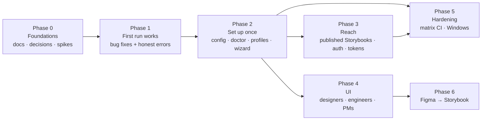

# Implementation plan

**Status:** Active
**Created:** 2026-10-07
**Inputs:** [current architecture](../architecture/current-state.md), [target architecture](../architecture/target-architecture.md), [current journey](../ux/current-journey.md), [Vue field test](../research/2026-10-07-vue-library-field-test.md)

## North star

A non-developer pushes a component from Figma to Storybook, as proper code for a reusable component, without writing a line of code ([product decision 0007](../product/decisions/0007-success-measure-layman-pushes-component.md)). Phases 1-4 make Storysync usable by anyone; Phase 6 delivers the north star.

## Overview

| Phase | Goal | Blocked by | Size |
|---|---|---|---|
| 0 | Shared understanding and decisions | — | S |
| 1 | A real repo's first run either works or says exactly why not | Nothing; can start now | M |
| 2 | Set up once, remembered; one command proves the chain works | ADR 0003, 0004 accepted | L |
| 3 | Tokens and props complete for real libraries (v1); published and protected Storybooks (with hosting) | [0008](../product/decisions/0008-v1-scope.md) | M (v1) |
| 4 | A local UI that designers, engineers and PMs can use without a terminal | Spike S5; ADR 0006 | XL |
| 5 | Stays working across frameworks and platforms | Phases 2-3 | M |
| 6 | A designer's Figma component becomes proper, reviewed code in Storybook | Phase 4; Q2 (deferred) | XL |

Sizes: S ≤ 2 days · M ≤ 1 week · L ≤ 3 weeks · XL > 3 weeks.

**Where the work lands:** the `ux-biswarup/storysync` fork ([product decision 0001](../product/decisions/0001-develop-in-fork.md)). Phase 1 items are general bug fixes, so they stay good candidates for upstream if we offer them later.

**Order:** Phase 4 (UI) can start once Phase 2's app services exist. It doesn't need to wait for Phase 3.

---

## Phase 0: Foundations

| # | Item | Done when |
|---|---|---|
| 0.1 | ✅ Docs structure, architecture, ADRs 0001-0005, journey, plan | This folder exists |
| 0.2 | ✅ Project skills: `record-decision`, `field-test` | In `.claude/skills/` |
| 0.3 | ✅ Take product decisions P1-P8 | All answered ([decisions](../product/decisions/README.md)); P4 (v1 scope) proposed, awaiting confirmation |
| 0.4 | Review and accept or reject ADRs 0002-0005 | Statuses updated |
| 0.5 | *(With hosting)* **Spike S1:** read `argTypes` with enum options from the preview runtime on a static build (React and Vue) | Research note with the result |
| 0.6 | *(With hosting)* **Spike S2:** reach the SSO-protected 4flow Storybook with a session cookie or header | Research note |
| 0.7 | *(After v1)* **Spike S3:** Angular (compodoc) and Web Components (CEM) through addon-mcp | Research note; draft profiles |
| 0.8 | **Spike S4:** measure the tokens used and time taken by one push of the example today | Baseline numbers in a research note |
| 0.9 | ✅ **Spike S5:** from a local Node script, drive **headless Claude Code**: stream its progress, use the user's Figma MCP to write to a test file, add Storybook MCP and a custom MCP server, route permission prompts to our own approval tool. Windows and macOS. **Decides ADR 0006.** | Passed on Windows: [research note](../research/2026-10-07-s5-headless-claude-code.md). macOS still to check. |
| 0.9b | ✅ **Spike S5b:** two-way session with `--input-format stream-json`: Claude asks a question, the UI answers, the run continues. Also try `--append-system-prompt` for the role (S5 findings F2, F3). | Passed: [research note](../research/2026-10-07-s5b-two-way-session.md). ADR 0006 ready to accept. |
| 0.10 | ✅ ~~Spike S6: Claude authentication~~ Settled by [0009](../product/decisions/0009-claude-code-only.md): the user's own Claude Code login | — |
| 0.11 | *(With hosting)* **Spike S7:** is the Figma REST API enough for PM views? | Research note |
| 0.12 | ✅ **Spike S8:** from Button in the Vue library, can Claude Code learn the library's conventions and generate a new, similar component from a Figma frame that passes type-check, lint and `verify`? An early test of the north star. | Done: [research note](../research/2026-10-07-s8-component-generation.md). Code quality ✅, fidelity 91.3%, duplicated an existing component. Fed into 4.5, 6.2, 6.2b, 6.3. |
| 0.12b | ✅ **Spike S8b:** S8 with a guided procedure | Done: [research note](../research/2026-10-07-s8b-guided-generation.md). Questions and fidelity (95.7%) ✅; reuse check and line heights need Storysync code (6.2b, 6.3). |

## Phase 1: First run works

No decisions needed. Each item is a small, testable PR.

| # | Item | Solves | Size |
|---|---|---|---|
| 1.1 | ✅ **`init` finds quoted keys** (`"addons": [`), as Storybook's installer writes them, and adds the Vue flag in the config's own style. *Done with a widened pattern, not an AST: it fixes the failure seen, with no new dependency. A full AST editor is left for the wizard (2.8).* | A3 | M |
| 1.2 | ✅ **`init` resolves versions from the lockfile**, not just `node_modules`, and picks the matching addon. It shows which packages the install will change and asks first. | A4 | S |
| 1.3 | ✅ **`init` warns when Storybook is running** before installing (Windows file locks), and offers to continue anyway | Journey: Connect | S |
| 1.4 | ✅ **Diagnose missing docs tools correctly.** Read the Storybook version, framework and `features`, and name the missing flag (`componentsManifest`, `experimentalDocgenServer` for Vue). Never tell users to upgrade when the version is already fine. | A2 | S |
| 1.5 | ✅ **Tailwind v4 stub detection.** A `tailwind.config.*` with no `theme` no longer wins; fall through to `@theme` and `:root`. Print why a source was chosen. | A5 | S |
| 1.6 | ✅ **Fix the "Detected:" label** when `--source` is given. End `tokens` output with a summary of uncategorized tokens grouped by prefix, plus how to include them. | A6 | S |
| 1.7 | ✅ **Report skipped props** in `map` (and `inspect`, `map --json`): name, type, and whether it's a free value or a type whose values aren't visible. *Not in `snap` yet: as a snap warning it would fail existing `--strict-warnings` runs.* | A9 | S |
| 1.8 | ✅ **Default `--storybook` to `http://localhost:6006`** and say so when it's used. Make the `clean` script cross-platform. | A5 | S |

**Phase 1 acceptance:** rerun the [Vue field test](../research/2026-10-07-vue-library-field-test.md) from scratch, using the `field-test` skill. The run needs no hand edits other than the feature flags, which `init` adds after confirming with the user. Every failure message names its fix.
**✅ Met** on 2026-10-07: [rerun](../research/2026-10-07-vue-library-phase1-field-test.md). 0 hand edits. 610 tests, the same 23 Windows-only failures as before Phase 1 (5.2).

## Phase 2: Set up once

| # | Item | Solves | Depends on | Size |
|---|---|---|---|---|
| 2.1 | **`storysync.config.json` + JSON Schema**, loaded by every command. Precedence: flag > env > config > detection. | A5 | ADR 0004 | M |
| 2.2 | **`storysync doctor`** checks every link: Node, Chromium, Storybook reachable, source type, MCP tools, framework flags, token sources, Figma auth. Each line is ✅ or a named fix. `--json` for CI. | Journey: Push | 2.1, 2.3 | M |
| 2.3 | **Framework profiles** as data: `react-vite`, `nextjs-vite`, `vue3-vite`, `sveltekit`. Used by `init`, `doctor` and errors. | A2 | ADR 0003 | M |
| 2.4 | **`setup` registers MCP itself** (`claude mcp add`, Cursor's `mcp.json`, Codex's `config.toml`) after confirming with the user, and checks that the Figma connector is present | Journey: Push | | S |
| 2.5 | **`storysync plan`** previews a push: token collections and counts, components, variant counts, skipped props, caps, font warnings. Writes nothing. | A9, UX principle 2 | 2.6 | M |
| 2.6 | **Move command logic into app services that return result objects**; `index.ts` becomes wiring plus a text renderer. One command per PR. | A8 | | L |
| 2.7 | **Generate the README's support matrix from the profiles.** Add a "will this work for me?" section that points to `doctor`. | Journey: Discover | 2.3 | S |
| 2.8 | **Wizard: `npx storysync` with no arguments.** Detects the framework and Storybook, applies the profile's fixes (asking first), writes the config, registers MCP, then runs `doctor`. | Journey: Install, Connect | 2.1-2.4 | M |

**Phase 2 acceptance:** on a fresh clone of the example and of the Vue library, `npx storysync` followed by `npx storysync doctor` ends all ✅ with no hand edits.

## Phase 3: Reach

**v1 scope** ([0008](../product/decisions/0008-v1-scope.md), proposed): 3.3 and 3.4. Items 3.1 and 3.2 move to hosting.

| # | Item | Solves | Depends on | Size |
|---|---|---|---|---|
| 3.1 | *(With hosting)* **`StorybookSource` interface + `StaticSource`**: catalogue from `index.json`, props from the preview runtime. `source: auto` tries MCP, then static. | A1, A10 | ADR 0002, S1 | L |
| 3.2 | *(With hosting)* **Auth for protected Storybooks**: headers or a cookie taken from an environment variable, never written to disk or JSON | A1 | S2 | M |
| 3.3 | **Token categorization rules in config** (glob → category), plus reading `@theme` next to a Tailwind config. Built-in presets for PrimeVue/Aura. | A6 | 2.1 | M |
| 3.4 | **String props with known values**: use `argTypes.options` and story args as enum values when the prop type is a plain string | A9 | 3.1 | M |

**Phase 3 acceptance (v1):** on the Vue library, radius, typography and shadow tokens reach the plan, and Button's `severity` and Badge's props appear as variants.
**With hosting:** `npx storysync plan` works against `https://ui.platform.4flow-software.com/latest/` with a cookie from the environment, with no changes to the Vue library repo.

## Phase 4: UI

For designers, engineers and PMs ([0002](../product/decisions/0002-serve-designers-engineers-and-pms.md)). A UI that orchestrates MCP tools, not a Figma plugin ([0003](../product/decisions/0003-ui-orchestrating-mcp-not-figma-plugin.md)). Architecture in [ADR 0006](../architecture/adr/0006-ui-orchestration-architecture.md).

| # | Item | Depends on | Size |
|---|---|---|---|
| 4.1 | **Single-source the skills.** One source generates `claude-code.md`, `codex.md` and `cursor.mdc`, and a test fails if they are stale. The orchestrator's prompts come from the same source. | ADR 0005 | M |
| 4.2 | **Move the Figma Plugin API code out of prose into versioned templates** that ship with the package. Compare tokens and time against the S4 baseline. | 4.1 | L |
| 4.3 | **UX design of the UI:** journeys and screens per role, written to `docs/ux/` before building | P8 | M |
| 4.4 | **`storysync ui` server:** HTTP API and event stream over the app services. Deterministic views first: setup and `doctor`, the `plan` preview, measured components, `verify` scores. | 2.6, 4.3 | L |
| 4.5 | **Claude Code runner:** spawn headless Claude Code with Storybook MCP, Figma MCP and Storysync's MCP server. Push to Figma from the UI, with an approval gate and live progress. Per S8 (R6, R7): allow `localhost` and Claude Code's temp folder; check Bash working directories; only stop processes the session started; **stop every process the session started when the task ends**; finish tasks with a typed `storysync_submit_result` tool. | S5, 4.2, 4.4 | L |
| 4.7 | **Onboarding in the UI:** check Node, Claude Code login, Figma connector, Storybook; guide through anything missing | 2.2, 4.4 | M |
| 4.6 | **PM view:** sync status and drift across the library, from `diff` with no agent (REST API reads with hosting, S7) | 4.4 | M |

**Phase 4 acceptance:** a designer with no terminal experience (apart from starting the UI, if P8 is local) previews and pushes Button, Tag and Badge from the Vue library to Figma and sees the fidelity score. A PM can see what is in sync without running anything.

## Phase 5: Hardening

| # | Item | Size |
|---|---|---|
| 5.1 | **v1:** a `vue3-vite` example Storybook (PrimeVue + Tailwind v4) next to the React one, run in CI against `list`, `map`, `snap` and `doctor` | M |
| 5.2 | **v1:** Windows in the CI matrix | S |
| 5.3 | Contract tests for Storybook internals we depend on (docs tools output, preview runtime, config AST) across the latest two minors | M |
| 5.4 | Rerun the field test on every minor release, with the `field-test` skill | S |

## Phase 6: Figma → Storybook

The north star. Scope: everything, up to full component code, as a pull request ([0006](../product/decisions/0006-figma-to-storybook-full-scope.md)). Shape in [target architecture §9](../architecture/target-architecture.md#9-figma--storybook). Spike S8 (0.12) tests the riskiest part early.

| # | Item | Depends on | Size |
|---|---|---|---|
| 6.1 | **ADR for the `CodeWriter`**, the change set and the quality gates (checklist settled in [0007](../product/decisions/0007-success-measure-layman-pushes-component.md); both design modes in [0010](../product/decisions/0010-support-scratch-and-library-based-components.md)) | S8, Phase 4 | S |
| 6.2 | **Conventions:** use the repo's own AI guidance (`CLAUDE.md`, `AGENTS.md`, skills) as the main source, which S8 showed works. Detect where docs and practice disagree (e.g. folder naming), and fill gaps (which token layer to use) with an engineer once. | 6.1 | M |
| 6.2b | **Reuse check (mandatory, done by Storysync):** before generating, Storysync itself searches every component's docs, props and story names (and Code Connect) for the design's concepts and structure, e.g. a `storysync_find_similar_components` tool, and hands the candidates to Claude and the designer: use it, extend it, or make a new one. S8 and S8b both duplicated `Card` (kpi): prompting alone produced only a file-name search. | 6.1, 4.5 | M |
| 6.3 | **Design reader + change set, library-based designs:** map instances to code components (Code Connect or name) and variables to tokens; capture **sizing mode** (fixed, hug, fill) and **line height**, resolving Figma's "auto" to a number (Inter ≈ 1.21 × size; S8b's only remaining fidelity gap); build a typed change set, shown in the UI for approval. Ambiguous intent (e.g. fixed width) becomes a question for the designer. | 6.1, 4.4 | M |
| 6.3b | **Design reader, from-scratch designs:** match raw values to the nearest tokens, show unmatched values as new tokens to approve, and suggest existing components for structures that look like them. Report how much of the design maps to the library. | 6.3 | L |
| 6.4 | **Token write-back:** Figma variable changes → the project's token files | 6.3 | M |
| 6.5 | **New components:** Claude Code generates the component, story, types and tests from the change set, the conventions and the token map, on a new branch. S8: the generation step itself works ($1.72, 6.5 min). | 6.2, 6.2b, 6.3, 4.5 | L |
| 6.6 | **Reverse verify and repair loop:** build Storybook, `snap`, `verify` against the Figma design; send differences back to Claude Code, up to a limit | 6.5 | L |
| 6.7 | **Pull request:** commit, push and open a PR with the fidelity score and screenshots. Decide Q2 (who reviews and merges) first. | 6.6 | M |
| 6.8 | **Changes to existing components:** new variants and props, style changes | 6.5 | L |

**Phase 6 acceptance = the north star:** in a test session, 4 of 5 non-developers each push a new component from Figma to Storybook through the UI, without help and without writing code. Include both a library-based and a from-scratch component. The PRs pass the checklist in [0007](../product/decisions/0007-success-measure-layman-pushes-component.md).

## Tracking

| Phase | Status |
|---|---|
| 0 | Done except macOS check of S5 and the hosting spikes (S1, S2, S7) |
| 1 | ✅ Done (uncommitted) |
| 2 | Not started |
| 3 | Not started |
| 4 | Not started |
| 5 | Not started |
| 6 | Not started |
