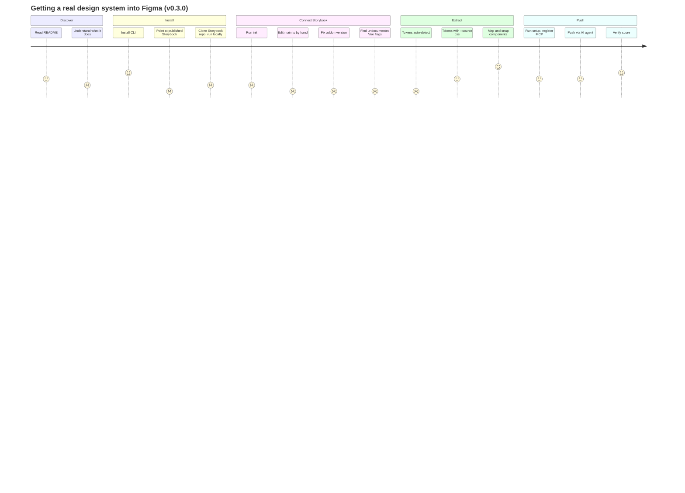

# Current user journey

**Status:** Accepted (describes v0.3.0)
**Evidence:** [Vue field test, 2026-10-07](../research/2026-10-07-vue-library-field-test.md)

The path a design system engineer takes today, from first hearing of Storysync to components in Figma. Severity: 🔴 stops most users · 🟠 costs significant time or trust · 🟡 annoyance.

## Stages and friction

| Stage | What the user does | Friction | Severity | Plan item |
|---|---|---|---|---|
| **Discover** | Reads the README | Long and dense. No picture of the workflow, no "will this work for my stack?" check. Vue isn't listed. | 🟠 | 2.7, 4.x |
| **Install** | `npm i -g storysync` | Two installs in two places (CLI here, addon in the Storybook repo); not obvious why | 🟠 | 2.1, 3.1 |
| | Points it at the team's published Storybook | Can't work: static build, behind SSO. The README says "dev server" but no command checks for it. | 🔴 | 3.1, 3.2 |
| **Connect** | `storysync init` | Can't edit `main.ts` with quoted keys; prints a snippet to paste | 🟠 | 1.1 |
| | | Installs a dependency that updates 106 packages, with no warning first; EPERM warnings because Storybook is running | 🟠 | 1.2, 1.3 |
| | | Picks the addon version before install changes Storybook's version | 🟠 | 1.2 |
| | `storysync list` | "Missing docs tools … upgrade Storybook". Wrong: the real cause is two feature flags. Fixing it means reading library source. | 🔴 | 1.4, 2.3 |
| **Extract** | `storysync tokens` | "No tokens found": picked an empty Tailwind v4 stub, with no hint to try another source | 🔴 | 1.5 |
| | `tokens --source css` | Prints "Detected: tailwind"; radii, type and shadows dropped as "uncategorized" | 🟠 | 1.6, 3.3 |
| | `map` / `snap` | Works well. String props skipped silently (Badge: no variants) | 🟡 | 1.7 |
| | Every command | `--storybook <url>` required every time | 🟡 | 2.1 |
| **Push** | `setup`, then `claude mcp add`, then the Figma connector | Three tools, each with its own setup, and nothing confirms the whole chain works | 🟠 | 2.2, 2.4 |
| | `/storysync-push` | Needs an AI client; no preview of what will change in Figma; long and costly | 🟠 | 2.5, 4.x |
| **Verify** | `storysync verify` | Clear score. Strong point. | — | |

## Moments that matter

1. **The first command after install.** Today it's likely to fail, and with an unclear message. That first result decides whether people continue.
2. **"What will this do to my Figma file?"** Nothing answers this before writing. Designers won't trust a tool that changes their library without showing them first.
3. **The fidelity score.** The best moment in the product, and it comes last. Users who give up during setup never see it.
